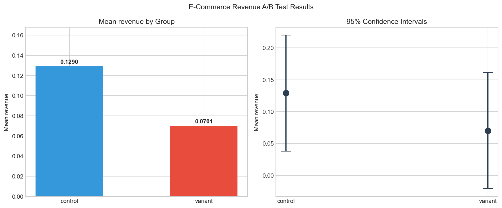

# E-Commerce Revenue A/B Test Analysis

A statistical analysis of a new user experience's impact on revenue per user using an independent samples T-test.

---

## Business Question

> *Does the new experience (variant) generate significantly higher revenue per user compared to the existing experience (control)?*

- **Control group:** Users exposed to the existing experience
- **Variant group:** Users exposed to the new experience
- **Metric:** Average revenue per user (continuous, numerical)

---

## Dataset

- **Source:** [Kaggle — A/B Test Results](https://www.kaggle.com/datasets/sergylog/ab-test-results-dataset)
- **Size:** 10,000 rows
- **Columns:**

| Column | Description |
|---|---|
| `user_id` | Unique user identifier |
| `variant_name` | Group assignment: `control` or `variant` |
| `revenue` | Revenue generated by the user (float) |

---

## Tech Stack

- Python 3.14
- pandas, numpy
- scipy, statsmodels
- matplotlib, seaborn
- Jupyter Notebook

---

## Analysis Steps

### 1. Exploratory Data Analysis (EDA)
- Loaded and inspected the dataset (shape, dtypes, null values)
- Verified group balance: Control 4,984 · Variant 5,016 ✓
- Calculated mean revenue per group:
  - Control: **0.1290**
  - Variant: **0.0701**

### 2. Hypothesis Formulation

- **H₀:** mean_revenue_variant = mean_revenue_control (no difference)
- **H₁:** mean_revenue_variant ≠ mean_revenue_control (difference exists)
- **Significance level:** α = 0.05
- **Test type:** Two-tailed

### 3. Statistical Test — Independent Samples T-Test

Revenue is a continuous numerical variable, so a T-test is used to compare group means.

```python
from scipy import stats

values_a = group_a['revenue']
values_b = group_b['revenue']

t_stat, p_value = stats.ttest_ind(values_a, values_b)
```

| Metric | Value |
|---|---|
| T-statistic | 1.2712 |
| P-value | **0.2037** |

### 4. Confidence Interval

```python
diff    = mean_b - mean_a
se_diff = np.sqrt((group_a['revenue'].var()/n_a) + (group_b['revenue'].var()/n_b))
ci_diff = (diff - 1.96*se_diff, diff + 1.96*se_diff)
```

| Metric | Value |
|---|---|
| Control mean | 0.1290 |
| Variant mean | 0.0701 |
| Difference | -0.0589 |
| 95% CI (difference) | (-0.1500, 0.0321) |

The confidence interval includes zero → difference is not statistically significant.

---

## Results

```
p-value = 0.2037 > α = 0.05
→ Fail to reject H₀
```



The variant group shows lower average revenue (0.0701) compared to control (0.1290). However, this difference is **not statistically significant** — both the T-test and the confidence interval agree.

The wide confidence intervals and overlapping ranges suggest the dataset may lack sufficient statistical power to detect a real effect, if one exists.

---

## Business Decision

Since no statistically significant difference was found:

- ❌ **Do not ship** the variant based on this test
- ✅ Consider increasing the sample size before re-testing
- ✅ Investigate whether the revenue distribution has high variance (most users have 0 revenue)
- ✅ Consider segmenting by user cohort or traffic source for deeper analysis

---

## Project Structure

```
ecommerce-revenue/
├── data/
│   └── AB_Test_Results.csv
├── ab_test.ipynb          # Main analysis notebook
├── ab_test_results.png    # Visualization output
└── README.md
```

---

## Author

**Kenan** — Junior Data Engineer  
Transitioning from data analytics · Learning through [DataTalks.Club DE Zoomcamp](https://github.com/DataTalksClub/data-engineering-zoomcamp)
